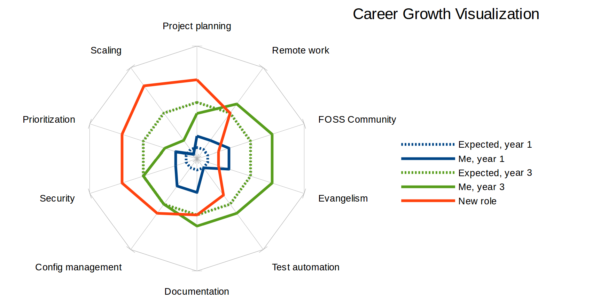

Skill Tree Balancing with a Job Move
====================================

I’ve recently identified some ways in which my former role wasn’t setting me
up for career success, and taken steps to remedy them. Since not everybody
lucks into this kind of process like I did, I’d like to write a bit about what
I’ve learned in case it offers some reader a useful new framework for thinking
about their skills and career growth.

**Tl;dr:** I’m moving from Research to Cloud Ops within Mozilla. The following
wall of text and silly picture are a brain dump of new ideas about skills and
career growth that I’ve built through the process.

.. more::

Managers as Mentors
-------------------

Oddly enough, I can trace the series of causes and effects that ultimately
culminated in my decision to switch roles straight back to a company that I’ve
never even worked at. By shaping my manager’s leadership skills, Microsoft’s
policies have trickled down into benefits to my open source focused career at
Mozilla.

Apparently, managers at Microsoft have targets to meet for their reports’
career growth and advancement, as well as the usual product and performance
metrics. I’ve heard that a manager there who meets all their other
deliverables but fails to promote the people under them can be demoted for
that negligence! I’ve learned about this culture because it showed up in my
own ex-Microsoft manager as a refusal to take “I’m happy where I am and don’t
think I particularly need to go seek a promotion” as a complete answer when he
asked about my goals for career growth and progression.

I have many peers whose managers seem fine with “I’m happy where I am” as an
answer to career goal questions. Replacing an employee for their lower-level
duties as they graduate to higher-level ones can be between inconvenient and
almost impossible for a boss, so it can seem to be in everybody’s best
interests to leave someone for a long time when they find a role where they’re
content. But my own manager’s ingrained distaste for allowing that kind of
stagnation led to a series of conversations that forced me to look at the
bigger picture of my career, and realize the ways that sticking with a role
that’s “good enough for now” could cause me serious problems years down the
road.

Complacency and the Same Year of Work
-------------------------------------

I’ve been warned over and over by mentors through the industry that it’s a
terrible idea to do the “same year of work” over and over. I’ve even repeated
that advice to others – “don’t tolerate a job that isn’t helping you grow!
Keep moving roles till you find something you love!”. This advice is
especially easy to follow when the “same year of work” you’re repeating is
unpleasant in some way.

However, I found myself in a role at Mozilla Research where the “same year of
work” is totally amazing! 3 times in a row, I came into a team with major ops
needs, and delivered value in a way that I’m great at to a team of awesome
people with expertise in areas where my knowledge is only superficial. And it
feels great to help them out and solve problems with knowledge that’s old hat
for me but novel to my colleagues. For each role, my progress eventually
reached a point where I’d solved all the problems that I could fix in a timely
manner – I’d hit the edge of my skills at the time. Although it’s educational,
working outside my skill set eventually slowed down my performance and work
quality to the point where it was better to have me shift focus to a group
whose needs were within what I could execute rapidly and with high quality.

The parts of this cycle in which I’m attempting a load of tasks primarily
outside my skill set (and often outside the set of skills that I have the
prerequisite skills to bootstrap myself into in a timely manner) can be
stressful, but on the whole it’s been a rewarding experience. I’ve felt like
I’ve gotten a “new role” every year or so, on about the timeline that a peer
starting with similar skills to my own might have had to switch companies to
find new opportunities. Without my manager’s guidance, I might have continued
in “same year of work” cycle indefinitely, but our conversations about career
progression helped me improve my understanding of how I personally grow as an
engineer.

Self-Teachable Skills
---------------------

What’s that “set of skills that I have the prerequisite skills to bootstrap
myself into in a timely manner” that I mentioned earlier? They’re those
challenges which I can identify and frame in a way which lets me ask the kind
of questions that get actionable answers. They’re knowledge gaps directly
adjacent to my established areas of expertise, about which I can concisely
frame questions whose answers I can use to accomplish a task. Despite being a
“team of one”, I’ve successfully self-taught skills such as learning a new
configuration management system and improving my FOSS community management
knowledge to solve particular challenges. Since I was already more skilled
than the average entry-level engineer in those areas when I started my solo
ops role, I had good heuristics for framing questions in a way that was likely
to yield the answers I wanted, and evaluating the credibility and
applicability of sources to learn from.

In other words, I’ve found that I can be successful at self-teaching a skill
when I can write out a template for what I know the correct answer to a given
question will look like. I might not know precisely which config management
system will meet my needs, but I already know a variety of pain points to look
out for and how to assess whether an example given in a tool’s docs is similar
to the task I’m looking to apply the tool on. I might not know exactly what
community management strategy is best for a given FOSS challenge, but I know
enough about community management in general to frame a question about what
strategy to use with all the relevant information and propose several viable
options to ask an expert for their opinions in selecting between.

Non-Self-Teachable skills
-------------------------

I’ve found that, in working as a team of one, I’ve done pretty well at growing
the skills that I had the appropriate foundation to “bootstrap” or
“self-teach”. However, there are other skills for which this hasn’t been the
case. Although these types of skills can be self-taught very slowly and
inefficiently,  I’m going to nickname them “non-self-teachable” for purposes
of this discussion. “Infeasible-to-self-teach”, while technically more
accurate, is just too much of a tangle to type out.

For skills with whose problem space I’m not fully acquainted, I find it
extremely challenging to improve in a timely manner in isolation. In areas
like prioritizing work across projects, and project planning, I find that my
ability to self-teach is limited when I don’t have sufficient expertise to ask
for help efficiently. When I don’t know what sort of answer would be
actionable, I struggle to frame general questions and figure out where to ask
them. And when I lack the expertise to identify what specific tasks I should
be asking for help to improve at, I miss many opportunities to seek help.

How did I discover these “unknown unknowns” of skills that I lack the
foundation to teach myself efficiently? I started noticing them when seeking
resources to understand my career growth options in order to refine my career
goals. In an internal wiki, I found a document which gives broad outlines for
and descriptions of the competence and impact of employees at each pay grade.
Mozilla’s is called a  Job Family Architecture; other companies have similar
documents with different names.  Comparing my performance to the descriptions
of higher levels helped me identify and articulate some particular skill areas
that I haven’t improved at the same rate as those where I’ve successfully
self-taught. Quantifying these areas that I’d like to work on has helped me
figure out what changes I could make to get into circumstances more like those
where I’ve improved rapidly at the “problem” skills in the past.

Bootstrapping Non-Self-Teachable Skills
---------------------------------------

When an engineer enters their very first job or internship, or touches a
programming language for the first time, it’s reasonable to assume that all
the skills they need to build are in the category that I’m describing as
non-self-teachable. Skills I’m currently expert at, and even teach to others,
started out as non-self-teachable for me as well. So what changed? How did I
go from having no idea what questions to ask about Git, to being able to solve
even its gnarliest problems with only a handful of StackOverflow queries or
man page checks?

When I look back at my career, the common denominators among times I’ve built
any skill from non-self-teachable to self-teachable have been peers and
mentors. Watching the way that a teammate addresses a challenge and comparing
it to the way I would have approached it gives me new insights at a rate that
no amount of struggling with the skill by myself ever could. And managers or
mentors who are subject matter experts in my field can compare the way I
approach a task to the way they would have, and point out differences to yield
skill-improving feedback. When I work closely enough with an expert for a
while , I build a mental model of the way they think, and for the rest of my
career I can ask myself “How would they have architected this? How would they
have tackled this problem?”.

These mental models can simulate a team in circumstances that are similar to
those where I worked with the experts, but as I advance into novel work in
isolation, the models become less and less useful because I can’t predict how
the expert would have approached a task unlike anything I’ve seen them
encounter.

Bridging My Skill Gaps
----------------------

Once I identified my skill gaps, I first attempted to seek better mentorship
in my existing role. After several different attempts, I determined that a
mentor’s intimacy with the particular task they’re giving feedback on is
integral to their ability to help me refine a technical skill. In both
individual and group mentorship, I found it easy to refine skills that I could
already self-teach, but between difficult and impossible to get good help on
skills about which I wasn’t yet expert enough to frame good questions. Doing
my best to improve within my existing role helped me figure out which skills
it was reasonable to try to improve in place, and which others were infeasible
to build in a timely manner under the circumstances.

I talked with my manager about what I’d learned about myself from the various
attempts to build the skills I regard as needing work. We evaluated our
options for putting me into a situation where I had the peers and mentorship
that I’m looking for: What would it look like to change my current role so it
had more peers? What would it look like to move me into a role on a team of
ops folks elsewhere? When we took into account some other skill gaps that I’m
interested in addressing, such as working with experts on infrastructure at
larger scale, we concluded that the best step to address my current concerns
was to explore my options for shifting to a different team.

At this point, I literally wrote down a list of relevant skills in my
notebook. I brainstormed a section of skills where I feel I’m below where I’d
like to be and would learn best from peers. I also outlined the skills I’ve
succeeded with in my present role, and the skills at which I consider myself
above average and thus am not worried about aggressively growing while I focus
on improvement in other areas.

I summarized my lists into the 2 key reasons I’m interested in a role change.
Those reasons are: I want to work with peers and mentors who can offer
detailed technical feedback based on their expertise at the problems I’m
solving, and I want to refine my prioritization and planning skills by being
more closely exposed to good examples in work like mine.

As I sought other teams that might meet these needs for me and interviewed
with them, I kept my lists and summary on my desk. I felt that having them in
sight made a real difference in my ability to clearly articulate my interest
in a role change, and helped me ask the right questions to determine whether
any team looked like a good match for my priorities. As I interviewed, I paid
attention to not only the technical topics that we discussed, but the
prospective colleagues’ attitude toward the answers I got wrong. On the team I
ended up selecting, I was especially impressed by the way that my future peers
ended each question by filling in any gaps between my answer and the complete
or best possible answer that they were “looking for”. This made the interviews
feel like a constructive conversation, and even if I hadn’t taken the role, I
would have left with a better understanding of the technologies we discussed.

New Team
--------

With all that, I’m excited to announce that I’m transitioning from Research to
the Cloud Ops team within Mozilla! This team supports a multitude of projects,
and there are always at least 2 ops engineers in a “buddy system” for every
project they support. The new role is similar to my old one in that it juggles
supporting many projects at once, but very different in that I’ll be working
directly with expert colleagues to learn their best ways to do it.

And yeah, I’m staying at Mozilla. It might net me more cash to jump ship to
another company, but monetary compensation is not what this move is optimizing
for. The drawbacks I would experience if I chose a team at another company
include greater uncertainty about what the team is actually like, and having
to re-learn all the specialized bureaucracy that comes with onboarding
anywhere. I also encounter very few other companies whose cultures are as
closely aligned with my own values, expecially pertaining to open source, and
none of them currently have openings that I can confirm are as good a match to
my current skill building goals as the Cloud Ops team.

Visualization
-------------

Drawing a picture is one of my favorite ways to gain control of and ask the
right questions about new knowledge. Here’s an ugly little chart into which
I’ve thrown a handful of skill areas and my approximate levels at them before
and after my old role… and of course, the skill emphases that have been
important to me in picking the right place to go next.

If you want to make a similar chart, I made that one with the `net chart type
<https://help.libreoffice.org/Chart/Chart_Type_Net>`_ in LibreOffice.

.. author:: E. Dunham
.. categories:: none
.. tags:: career, mozilla
.. comments::
