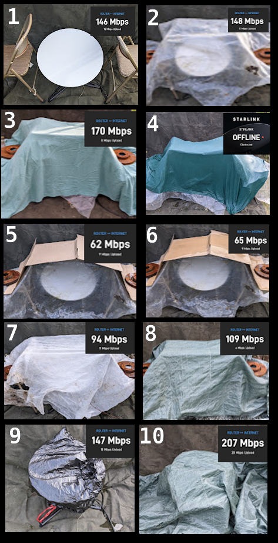

Playing Dress-Up With Starlink
==============================

Some friends showed me `a post <https://seclists.org/nanog/2022/Mar/63>`_ investigating whether Starlink dishes still work when decorated in various ways. They asked whether I was able to reproduce the results. So I pulled the dish down off my roof and tested it with a few things that I had lying around the house and yard. 

Methodology Notes: 
------------------

I gathered data in my camera roll: a snapshot of the setup, followed by a screencap of the "router <-> internet" pane of the speedtest within the Starlink Android app. I left the dish set up in the same spot, which was at ground level but reported no obstructions when I did the sky scan thing in the app. I power cycled the dish once during the experiment, roughly halfway through the control tests for the "is it slower?" question, because I needed to plug something else into the extension cord that it was using for a minute. 

I'm located south of the 45th parallel. 

Will It Send? 
-------------

For my first batch of tests, I was curious whether I could get any data in and out via Starlink with various configurations of stuff on and around the dish. I only ran one speedtest each for these.

I started by suspending things over Starlink, because I knew some of the materials would get heavy (such as wet cotton cloth) and I was scared of hurting the little motors inside that it uses to move itself around. I draped a canvas tarp over the north side of a fence to make an impromptu photo studio for the dish. The dish had an unobstructed view of the sky upward and to the north. I placed metal folding chairs to the east and west of the dish, with their backs closest to the dish, to hold up the various covers. I used some old brake pads to weigh down the things that I draped over the chairs so they wouldn't blow away. 

1) No cover, control to make sure Starlink works in this position. It sends. 146 Mbps down, 15 Mbps up. 
2) Covered with clear-ish greenhouse plastic. It sends. 148 Mbps down, 15 Mbps up. 
3) Same as (2) but with a cotton bedspread over the plastic. It sends. 170 Mbps down, 8 Mbps up. 
4) Same as (3) but with the bedspread soaking wet. It does not send. The app reports "offline, obstructed".
5) Plastic from (2) plus a single layer of corrugated cardboard box. It sends. 62 Mbps down, 9 Mbps up. 
6) Same as (5) but I dumped some water on the box. It mostly ran off. It sends. 65 Mbps down, 9 Mbps up. 
7) Double layer of row cover, like you put on plants in the garden to keep the frost from hurting them. It sends. 94 Mbps down, 11 Mbps up. 
8) Single layer of ratty old woven plastic tarp. It sends. 109 Mbps down, 6 Mbps up. 

For the final 2 tests, I got a bit braver about putting things directly on the dish, instead of just suspending them above it. 

9) Dish in a black plastic trash bag like you're throwing it out. It sends. 147 Mbps down, 10 Mbps up. 
10) Same tarp as from (8), but directly on the dish instead of hanging above it. It sends. 207 Mbps down, 20 Mbps up. 

Is It Slower?
-------------

As you'll notice in the numbers that I was getting in the above trials, sometimes covering the dish yields a faster single speed test than having it exposed. That seems wrong. I suspect that this is normal variance based on what satellites are available, but I don't actually know what behavior is normal. So I did a few more tests in configuration 10, and a bunch of tests in configuration 1, to make sure we're not in a timeline where obstructing a radio link somehow makes it perform better. 

.. list-table:: Plastic Tarp Covering Starlink (10)
    :header-rows: 1
   
    * - Mbps Down
      - Mbps Up
    * - 207 
      - 20
    * - 173
      - 5
    * - 138
      - 11
    * - 124
      - 13
    * - 180
      - 19
    * - 101
      - 9

.. list-table:: Unobstructed Starlink (1)
    :header-rows: 1

    * - Mbps Down 
      - Mbps Up
    * - 104
      - 24
    * - 114
      - 4
    * - 119
      - 10
    * - 100
      - 16
    * - 111
      - 14
    * - 147
      - 5
    * - 147
      - 5
    * - 97
      - 15
    * - 218
      - 15
    * - 87
      - 15
    * - 176
      - 16
    * - 192
      - 6
    * - 125
      - 6

I left it all out overnight, and the canvas tarp that I'd been using as a visual backdrop blew off of the fence so it was covering the dish. I made a video call on the connection with the canvas over the dish and didn't notice any subjective degradation of service compared to what I'm accustomed to getting from it. 

Conclusions
-----------

Starlink definitely still works when I put dry textiles between the dish and the satellite. It doesn't seem to matter if the textiles are directly on the dish or suspended a couple feet above it. 

I'm surprised that Eric Kuhnke's Starlink worked with 2 layers of wet bedsheet over it. The only case in which I managed to cause my Starlink to report itself as being obstructed was when I had a wet bedspread suspended in the air over it. I don't really want to start piling wet cloth directly on the dish, though, because wet cloth is heavy and I'm scared of overloading the actuators. 

Starlink gets kind of warm during normal operation, as demonstrated by the `cats <https://www.reddit.com/r/pics/comments/ru20n1/starlink_works_great_until_the_cats_find_out_that/>`_. I wouldn't want to leave mine in a dark colored trash bag or under a dark colored tarp on a sunny day in case it overheated. And there's no need to -- if you don't want people to know you're using one, you can just suspend an opaque and waterproof tarp above it and there'll be better airflow around the dish itself and thus less risk of overheating. 

Have fun!

.. author:: E. Dunham
.. categories:: none
.. tags:: none
.. comments::
