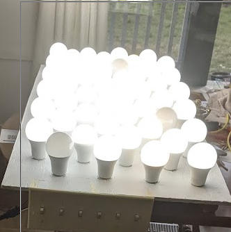
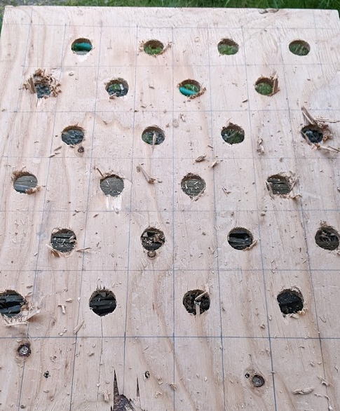
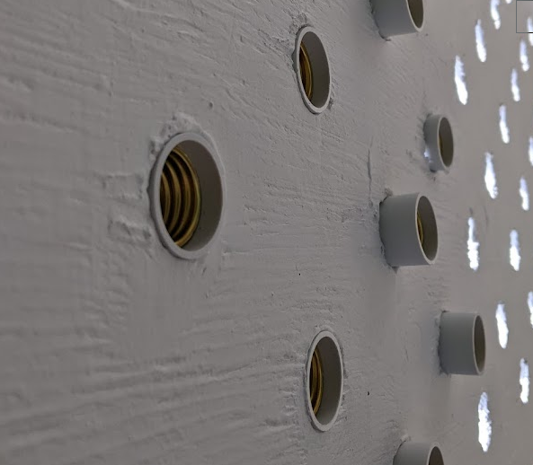
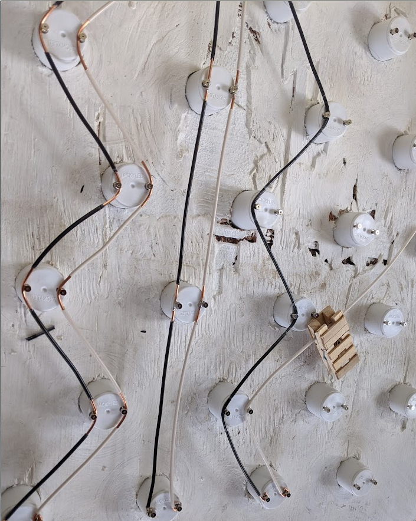
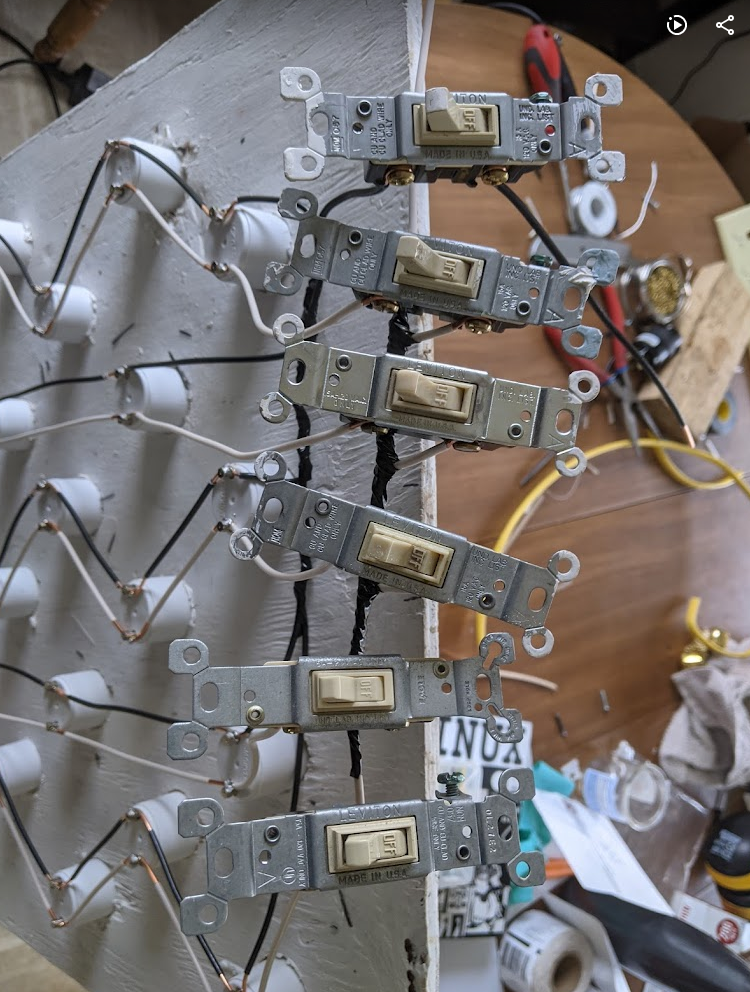
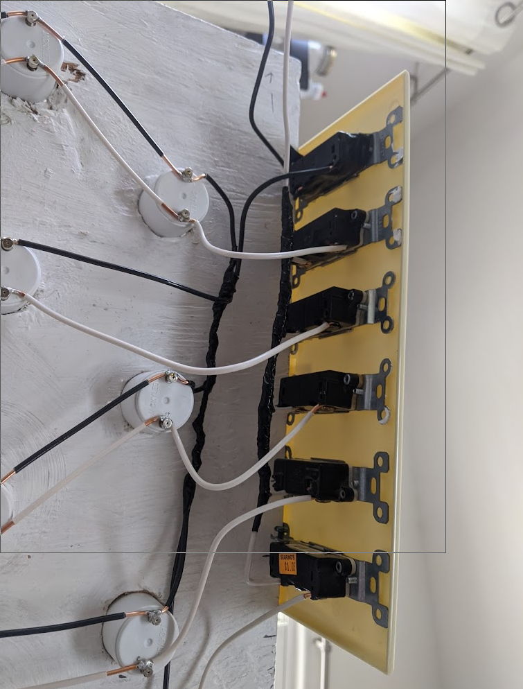
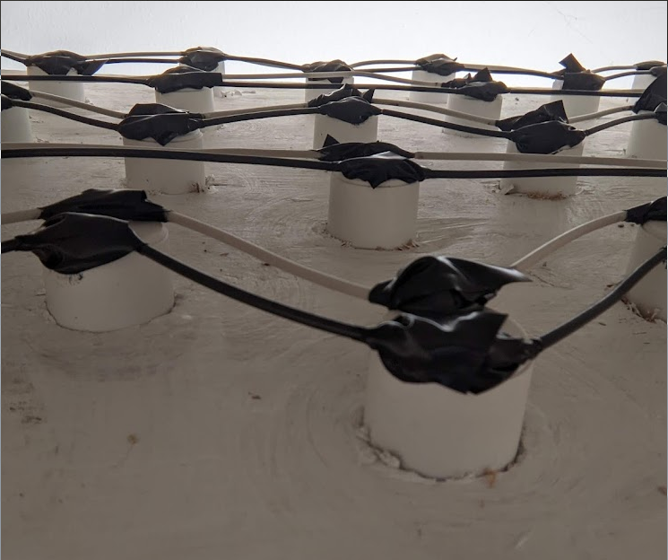
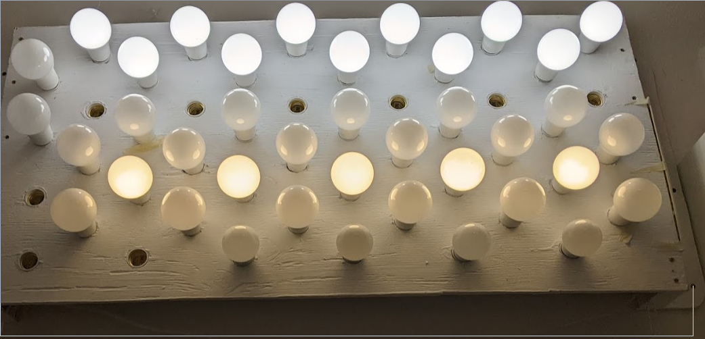

Lumenator
=========

About a year ago, I found out about `lumenators <https://www.lesswrong.com/posts/hC2NFsuf5anuGadFm/how-to-build-a-lumenator>`_. The theory is that if you put sunshine-ish amounts of light onto a creature, the creature reacts as it would in sunlight.

So, I built one. It's technically brighter than the sun. 

.. more:: 

Mine is composed of 48 e26 sockets mounted in a 2'x4' piece of plywood, with some switches that allow the rows to be turned on and off independently. It currently plugs into the wall, although I might eventually get around to hardwiring it if I ever get serious about cable management. 

Each of the 48 sockets is intended to hold an LED bulb of around 2500 lumens. I use a mix of color temperatures, with most bulbs 5000K but some 3000K. This means that with all the bulbs in and all the rows lit, it emits around 120,000 lumens from approximately 0.74 square meters, or about 162,162 lux. According to Wikipedia, sunlight is around 100,000 lux once you account for the atmosphere.

Here's how it looked with all the bulbs in it while I was testing it on my kitchen table. This photo was taken around 3pm in early April, 2021. That's midafternoon springtime daylight for comparison, visible out through the window. Yes, I was testing it by sticking the exposed wires into a C13. No, it didn't catch on fire. No, you should not try this at home. 

I've mounted the board of sockets onto the wall above my desk, so turning it on is like opening a variably sunny window. I typically use about 12-24 of the bulbs on a day to day basis, as more can make it bright enough to be slightly uncomfortable. 

I put off writing this post for a year because I never actually got around to filling in all 48 of the lamp sockets. As well as a few bulbs being dead on arrival, half a dozen of the bulbs I bought were duds. They made a horrible buzzing noise when powered, so I removed them. Over time I've also swapped out some of the daylight bulbs from the apparatus to light other rooms of my house, and installed ordinary 750-lumen bulbs into those sockets because it turns out that a matrix of light sockets is an extremely convenient place to store extra bulbs. 

Sourcing materials
------------------

The plywood, paint, and romex were left over from other projects.

I had a tough time sourcing affordable e26 sockets. Apparently people don't build ridiculous light fixtures from scratch on the cheap very much? I ended up using adapters meant to help you use e26 bulbs in GU24 sockets. The pins meant to interface with the GU24 socket were easy to solder wires onto later, and the cylindrical shape of the adapters made them easy to friction fit into holes in the plywood. 

I made a big spreadsheet of price per lumen of e26 LED bulbs available various places, ruled out those whose specs were incomplete or self-contradictory, and got the cheapest bulbs that seemed likely to add up to Too Much Light. 

The switches, 6-gang switchplate, and electrical plug came from Habitat For Humanity. 

Build Process
-------------

I chose the size based on what plywood I had around. On the plywood, I drew a grid of 96 rectangles. I drilled holes in alternating rectangles of the grid, to maximize space between bulbs, because I was frightened of making the kind of mistake that would cause the whole thing to overheat and catch on fire. 

The holes were drilled with a bit just a hair smaller than the GU24 adapter sockets, so that the sockets would be held in place by friction. A few holes came out too small for the sockets, but were easily enlarged with a rasp. 

I also rasped off any noticeable splinters. If I'd been doing fancy carpentry, I would have sanded the whole thing at this point. I wasn't, so I didn't. 

I painted the board white, for maximum light reflection. I thought about trying to do some kind of mirror or chrome finish behind the bulbs, but that seemed way too hard. If I was building it again, I would look for a plastic mirror and secure it to the plywood before drilling the holes. Or I might try gluing a sheet of mylar onto the wood after drilling the holes but before installing the sockets. 

The sockets installed flush with the board, by pushing them through the holes from the front side. I made sure to install all of them in the same orientation for each row, though this was actually unnecessary because alternating current doesn't care about polarity. To get the sockets flush with the board, I found that it was easiest to fit a row in and then place the whole board face-down on a flat surface and walk on it between the sockets. That way everything ended up even with the floor. If you don't like walking on your projects, you could probably achieve a similar effect by carefully hitting it with a hammer. 

I then wired the rows of lights to the switches. 3 of the switches control 12 bulbs each, and 2 control 6 bulbs each, because this seemed like the best compromise between using all 5 available switches and getting it to work with the limited quantity of romex that I had available. 

I test fit all the wires to make sure I had enough, then soldered them onto the pins of the GU24 adapters. Since I needed to strip off 1" of wire insulation from the middle of a wire a bunch of times, I built a tool for the job, by gluing razor blades to each side of the jaws of a pair of clothes pins. That way I'd just clip the tool onto the cable where I needed to strip it, spin it around so the blades cut through the insulation, and cut off the inch of insulation with another knife. 

You'll notice in the photos that I secured the switches by screwing them directly to the switch plate instead of putting them in a box. You're normally supposed to put switches in boxes, and I might regret this shortcut someday, but I didn't have a 6-gang box and it's been fine so far. 
 
Mind-numbing amounts of soldering later, I tested the assembly to make sure nothing was shorted, then powered it on to make sure it could light. Before installing it on the wall, I covered all the exposed wiring in electircal tape, mostly because I dislike exposed wires. Also, safety. But you'd get just as zapped from connecting the poles of any of those exposed sockets on the front as you would by connecting a pair of wires on the back, so worrying about hiding exposed conductors on the back but not the front is mostly aesthetic.  

I then affixed it to the wall above my desk, using a piece of 2x4 at each short end of the plywood to hold everything well away from the wall. I left the top and bottom open to improve air circulation in case it ran into thermal problems, but in a year of use it hasn't caught on fire. 

It looks underwhelming in photos, because very bright lights are hard to photograph. This shows how I us it on an ordinary day like today, with a set of 12 5000K bulbs and a set of 6 3000K bulbs lit and the rest remaining off. 

Costs
-----

If you built one of these today, it'd cost you: 

* about $20 for a 2'x4' chunk of plywood
* about $40 for a pack of 50 GU24 to E26 adapters
* about $160 for 48 2500-lumen e26 bulbs
* about $30 for 15 feet of 12 gauge 2-wire romex
* maybe $10 for switches and a 6-gang plate at your local Habitat For Humanity? 

So you'd be looking at around $260 for the whole build, unless you had materials on hand or found better deals on materials. 

Was it worth it?
----------------

I like having my false sun in my office, because I feel like being in bright light helps my brain and body agree that it's actually daytime. It also helps me fake a summer sleep schedule when the weather outside suggests wintry hibernation. I notice that being in natural daylight at dusk (even when dusk is at 6pm!) causes me to feel sleepy, whereas being in midday-sunlight light levels circumvents that process. 

The false sun was somewhat inconvenient to build and install, and would not be accessible for everyone. I was able to make it because I have woodworking and soldering equipment already available, and because I was able to screw it directly to the wall of my office without penalty. 

If I was renting my home, I would have mounted the lightbulb array in a bookcase or other tall piece of furniture instead of attaching it onto the wall. If I was building one of these for use in a rental, I'd probably keep the holes-in-plywood scheme for supporting the lamp sockets, but I would size it to mount over the top couple shelves of an Ikea Billy or similar cheap bookcase, including some room for airflow.

For other locations in my house, I've become partial to the 5,000-lumen 4' LED "shop" lights that my local Harbor Freight sometimes has on sale for $20 apiece. I find them trivially easy to install and plenty bright to send most of that "it's daytime!" signal. However, they're over twice as expensive per lumen compared to the DIY version. 

You probably shouldn't build exactly what I did, as it's bulky and inconvenient and not all that aesthetically pleasing. But I hope this project demonstrates that it's perfectly achieveable to create a light fixture brighter than the sun! When playing with electricity, please learn what you're doing beforehand, be mindful that alternating current can kill you, and generally use common sense. If you try to build or modify something like this without having a basic idea of electrical safety, you're just sticking a fork in an outlet but with extra steps. 

.. author:: E. Dunham
.. categories:: none
.. tags:: none
.. comments::
