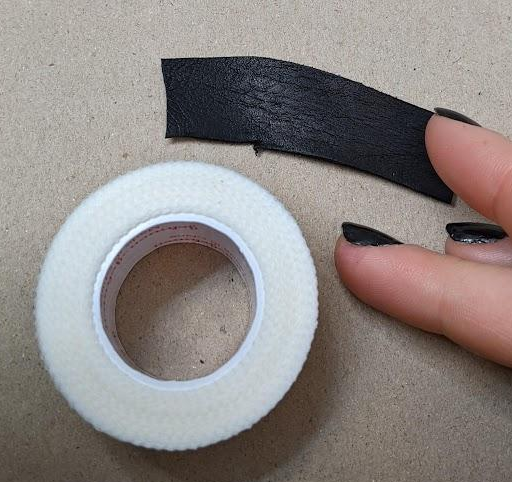
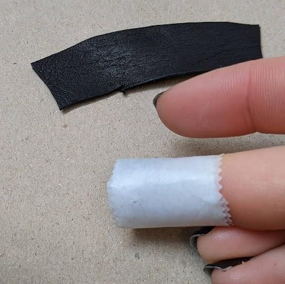
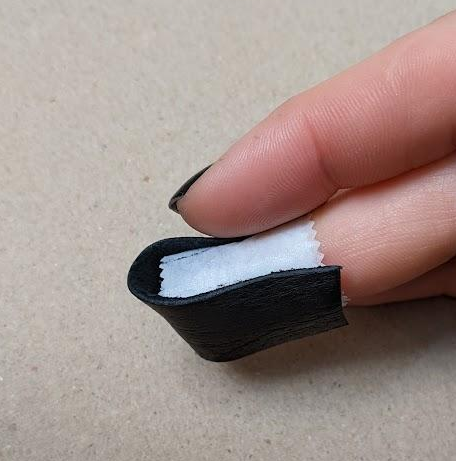
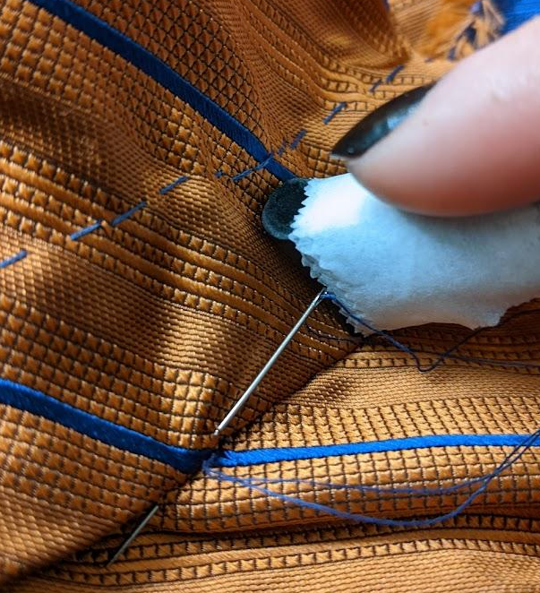
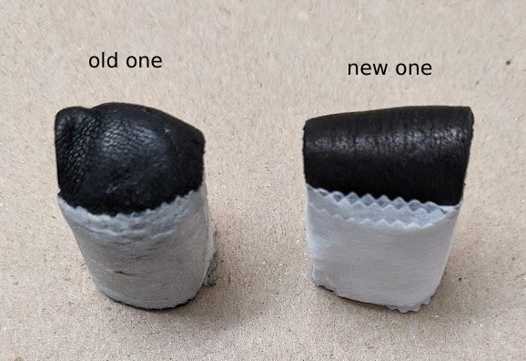

DIY Thimble
===========

Over the past couple weeks, my schedule has had a higher than usual
concentration of the kind of meetings where one sits off-camera and listens to
a presenter talk. Like many engineers who knit in meetings, I find that keeping
my hands busy helps me focus. Knitting puts me on the losing side of a battle
between "don't drop any stitches" and the laws of physics, however, so instead
I've been hand sewing quite a bit. 

.. more::

I've been aware for some time that sewing with a thimble is Objectively Better
than sewing without, but I somehow made it to adulthood without learning to use
a thimble properly, let alone avoid losing one between setting a project down
one month and picking it up again the next. I have DIY'd a lot of various
leather thimbles over the years to try to sew with them, but the designs have
been a hassle to assemble, unusable, or both. However, I have finally stumbled
across a design that doesn't fail or annoy me in the ways that all the previous
ones did. 

It's embarrassingly easy to make. By embarrassingly, I mean "why didn't I
figure this out decades ago?!" All you need is some surgical tape, and a piece
of leather about as wide as your finger and long enough to wrap over your
fingertip. 

1. Wrap your finger in a couple layers of surgical tape, sticky side out. You
want it tight enough to not fall off too easily, but loose enough to slip on
and off later. 

2. Put the piece of leather onto your finger over the tape, so it covers the
spot you keep accidentally jabbing with the needle when you fail to use a
thimble. 

3. Wrap the whole thing with a couple layers of surgical tape, sticky side in. 

That's literally all there is to it. If you don't like using leather, cardboard
might work, or any plastic that's flexible but sturdy enough to be hard to jab
a needle through. 

The one of these that I made earlier in the week and have been using ever since
has molded to the shape of my finger and only gotten more comfortable over
time. 

P.S. That's a heavy silk jacquard, pretty on both sides, 28" wide without good
selvedges but `they
<https://www.fabric.com/buy/0795939/100-silk-jacquard-double-face-medium-blue-orange>`_
currently have it on Please Go Away sale for $3.13/yard. The fibers burn and
smell like silk, and it feels like silk, so I don't think they're lying about
the composition. The selvedges aren't too nice, one side is fuzzy and the other
seems to have just been cut, but for a price like that I can't complain. The
orange is more coppery in natural light than the photos make it look on my
monitor. 

.. author:: E. Dunham
.. categories:: none
.. tags:: none
.. comments::
