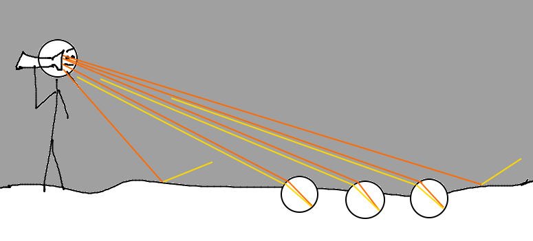
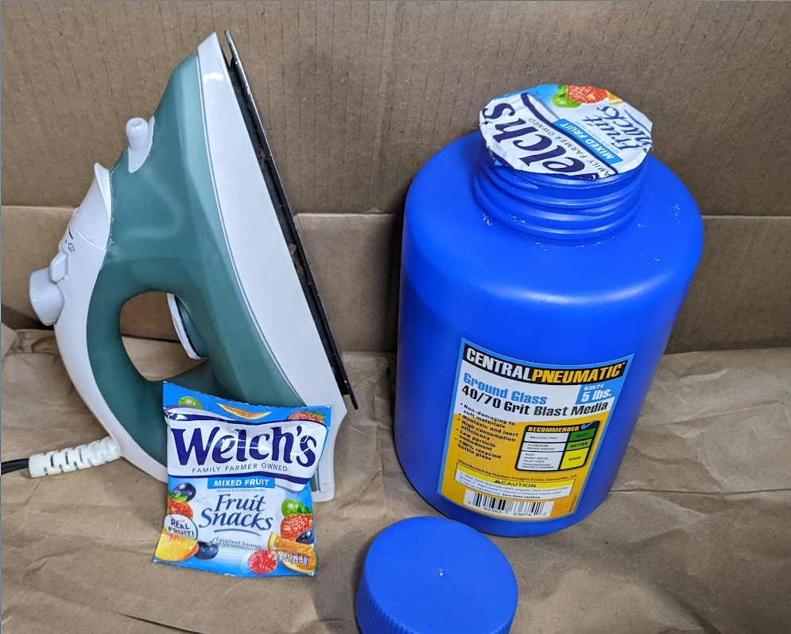
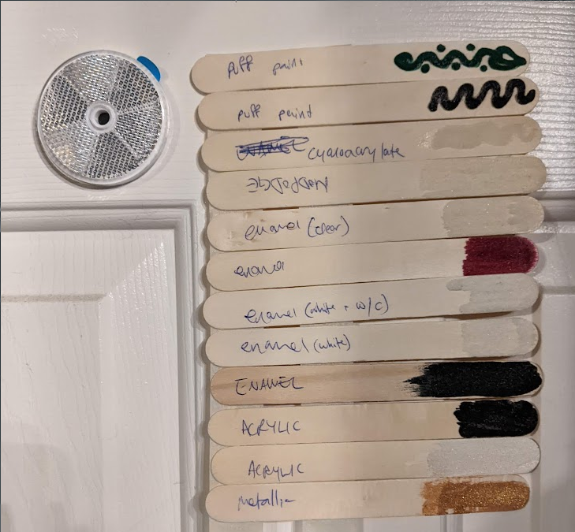
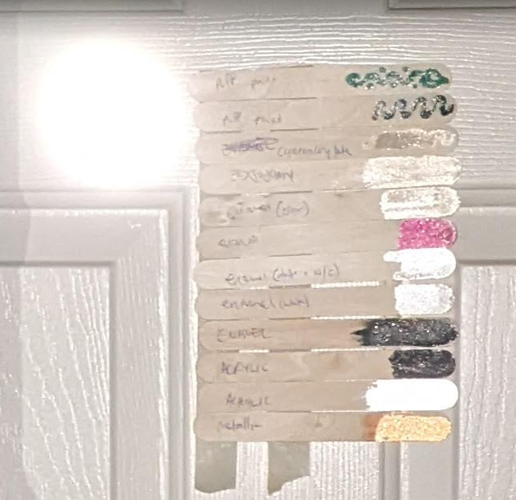
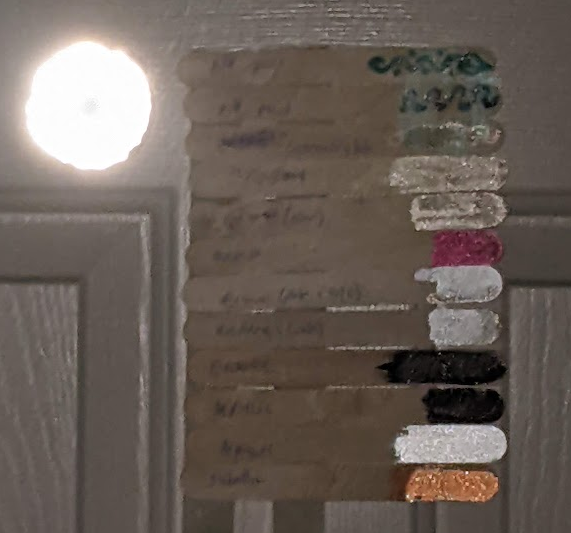
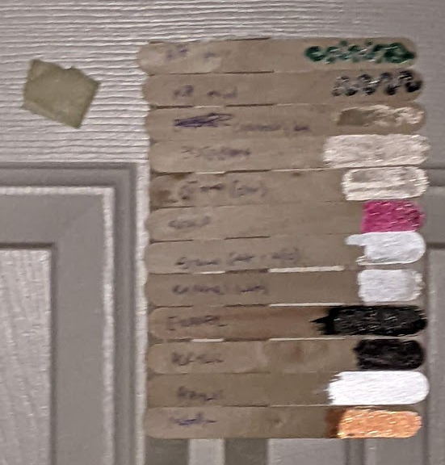

Retroreflectors & Storing Ground Glass
======================================

`Retroreflectors <https://en.wikipedia.org/wiki/Retroreflector>`_ are fun. I finally got around to picking up some cheap glass blast media today (mine's the 40/70 grit recycled bottle glass from Harbor Freight / Central Pneumatic) and did some testing with various paints and glues that I had lying around. I'm using it as retroreflective beads. When I hear "beads" I think of things with holes in them for putting on a string, but in this case it means more like beads of condensation -- tiny round blobs. They feel gritty like beach sand, and being made from clear glass, they look like unusually sparkly white sand as well.

.. more::

Roughly a decade ago I stumbled across a PDF that did a good job of explaining the physics of glass bead retroreflectors, which I can of course no longer find. It was published by some highway department and contained extreme detail about the temperature tolerances for applying retroreflective beads to the fog lines on roads, because the retroreflective properties only work if the glass beads are embedded just over halfway into the paint. If the beads sink too far into the paint they can't work their light-bending physics magic, and if they're embedded too shallowly into the paint they'll easily come un-stuck from it. 

Mental Model
------------

Here's how I think about bead-type retroreflectors. Physics means that the glass beads basically bounce the light straight back toward where it came from, so the stick figure is holding the flashlight close to its eyes for maximum testing effectiveness over short distances. The beads are obviously not to scale.

The beads have a different index of refraction from the surrounding air. That just means that light bends at a certain angle when it goes from air to glass, and it bends at that angle again when it goes from glass to air on its way out. 

The surface of the bead that's covered in paint reflects light, perhaps only some of the light depending on the color of the paint. White paint reflects the most light, of course. 

The light goes into the bead, bends a little, bounces off the paint, goes almost straight back through the bead the way it came, bends a little when it hits the air, and ends up going more or less straight back toward the light source. 

I've drawn the light in orange before it bounces off the paint and in yellow after it bounces off, to kind of illustrate how it behaves differently hitting the painted floor when it's gone through a retroreflective bead versus when it's just gone through the air. 

Storing the blast media
-----------------------

The one problem with even 5lbs of ground glass is that it does its utmost to get everywhere. If the bottle is ever inverted with the lid on and the lid gets bumped, the sand-like glass ends up everywhere the next time you take the lid off. 

Plastic bottles like this come with a "safety" seal when I buy food stuff like spices in them, and I've never had a problem with those getting all up in the cap and spilling everywhere. 

I tried ironing a scrap of mylar food packaging (a fruit snacks bag was most conveniently accessible) onto the plastic bottle, and it stuck nicely! I used my clothes iron on the Cotton setting. Now the beads will stay in the jar until I want to use them again. 

Paint/Glue Testing
------------------

I put various sorts of paint and glue onto popsicle sticks and sprinkled them with the blast media. I then put them on the door of a room with good blackout curtains, took a photo, turned out the lights, and took a flash photo. 

I used a commercial plastic retroreflector in the first two photos as a control for how well the DIY ones were working. 

Here's how it looked with the lights on: 

From top to bottom, the samples are: 

* Dark green puff paint / fabric paint
* Black puff paint / fabric paint
* Superglue
* modpodge
* clear nail polish
* dark red nail polish
* 1 coat white nail polish, then half white half clear nail polish with beads on the second coat
* white nail polish
* black nail polish
* black acrylic paint
* white acrylic paint
* metallic gold-ish paint stuff

Everything except the two-coat enamel test had the glass beads poured directly onto the one layer of the paint or glue. Yes, I labeled modpodge upside down. I wasn't planning to take photos at first but then I realized if I was going to post about it I probably should. 

Here's how that setup looks in a flash photo from maybe 10' away, in a dark room: 

Here's how it looks from the same distance, still a dark room, but I zoomed in more: 

And here's how it looks, still zoomed in, but with the commercial reflector removed: 

Conclusions
-----------

The cheapest glass sandblast media that I could get ahold of works surprisingly well as a retroreflector when applied to white paint. The performance difference between beads on white and beads on darker colors was surprising. The clear glues (superglue and mod podge) worked better than the darker colored paints, which was a bit surprising. 

My biggest surprise was how the white sample almost blended in with the white door in ambient lighting, yet stood out so much in the dark. 

Further stuff to test with this includes doing the glue thing on a darker background color, and trying various types of clear topcoat over the bead layer. I don't think those will work, but then again I did think the black paint might work, so it's worth testing. 

.. author:: E. Dunham
.. categories:: none
.. tags:: none
.. comments::

